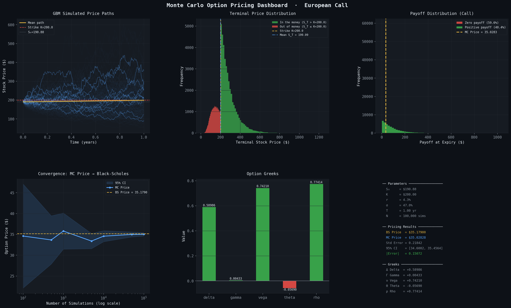

<div align="center">

# Monte Carlo Option Pricing

**Pricing European options via simulation — validated against Black-Scholes**


</div>

---

## Dashboard Preview



> *100,000 simulated paths · European Call · S₀=$100 · K=$105 · σ=20% · r=5% · T=1yr*

---

## Overview

This project prices a **European option** two ways and compares them:

| Method | Approach | Price |
|--------|----------|-------|
| **Monte Carlo** | Simulate 50,000 random futures, average the payoffs | ~$7.99 |
| **Black-Scholes** | Closed-form analytical formula | $8.02 |

The two methods converge within **3 cents** — confirming the simulation is correct.

---

## How It Works

### 1. Geometric Brownian Motion (GBM)

Stock prices follow a random walk with drift:

```
S(t+Δt) = S(t) · exp( (r - σ²/2)·Δt  +  σ·ε·√Δt )
```

where `ε ~ N(0,1)` is a standard normal random shock drawn at each time step.

### 2. Monte Carlo Pricing

```
Option Price = e^(-rT) · (1/N) · Σ payoff(Sᵢ_T)

Payoff (Call) = max(S_T - K, 0)
Payoff (Put)  = max(K - S_T, 0)
```

### 3. Black-Scholes Formula

```
Call: C = S₀·N(d₁) - K·e^(-rT)·N(d₂)
Put:  P = K·e^(-rT)·N(-d₂) - S₀·N(-d₁)

d₁ = [ ln(S₀/K) + (r + σ²/2)·T ] / (σ·√T)
d₂ = d₁ - σ·√T
```

---

## Project Structure

```
monte-carlo-option-pricing/
│
├── main.py              ← Entry point — run this
├── gbm.py               ← GBM simulation engine
├── black_scholes.py     ← Analytical pricer + Greeks
├── monte_carlo.py       ← MC pricer + convergence study
├── visualizer.py        ← Full matplotlib dashboard
├── requirements.txt     ← Dependencies
└── README.md
```

---

## Quickstart

```bash
# 1. Clone the repo
git clone https://github.com/AnwaayBadwaik605/monte-carlo-option-pricing.git
cd monte-carlo-option-pricing

# 2. Install dependencies
pip install -r requirements.txt

# 3. Run
python main.py
```

---

## Configuration

All parameters are at the top of `main.py`:

```python
PARAMS = {
    "S0":    100.0,   # Current stock price ($)
    "K":     105.0,   # Strike price ($)
    "r":     0.05,    # Risk-free rate (5% per annum)
    "sigma": 0.20,    # Volatility (20% per annum)
    "T":     1.0,     # Time to expiry (1 year)
    "N":     50_000,  # Number of Monte Carlo simulations
    "M":     252,     # Time steps (trading days in a year)
}

OPTION_TYPE = "call"   # "call" or "put"
```

---

## Dashboard Panels

| Panel | What it shows |
|-------|--------------|
| **GBM Price Paths** | 50,000 simulated stock trajectories with mean path and strike line |
| **Terminal Distribution** | Final stock price histogram split by in/out of the money |
| **Payoff Distribution** | Distribution of option payoffs at expiry |
| **Convergence** | MC price converging to Black-Scholes as simulations increase |
| **Greeks** | Delta, Gamma, Vega, Theta, Rho from Black-Scholes |
| **Summary** | All parameters, prices, error, and Greeks in one place |

---

## Example Output

```
=======================================================
  Monte Carlo Option Pricing
=======================================================
  Option Type : CALL
  S0=100.0  K=105.0  r=5.0%  σ=20.0%  T=1.0yr
  Simulations : 50,000   Time steps : 252
=======================================================

[1/4] Running Monte Carlo simulation...
      MC Price   = $7.98977
      Std Error  = 0.05876
      95% CI     = [$7.8746, $8.1049]

[2/4] Computing Black-Scholes price...
      BS Price   = $8.02135
      |Error|    = 0.03159

[3/4] Computing Greeks...
      Delta  = +0.542228
      Gamma  = +0.019835
      Vega   = +0.396705
      Theta  = -0.017198
      Rho    = +0.462015
```

---

## References

- Black, F. & Scholes, M. (1973). *The Pricing of Options and Corporate Liabilities*. Journal of Political Economy.
- Hull, J. (2022). *Options, Futures, and Other Derivatives*. Pearson.
- Glasserman, P. (2003). *Monte Carlo Methods in Financial Engineering*. Springer.

---

<div align="center">
Made with Python · NumPy · SciPy · Matplotlib
</div>
